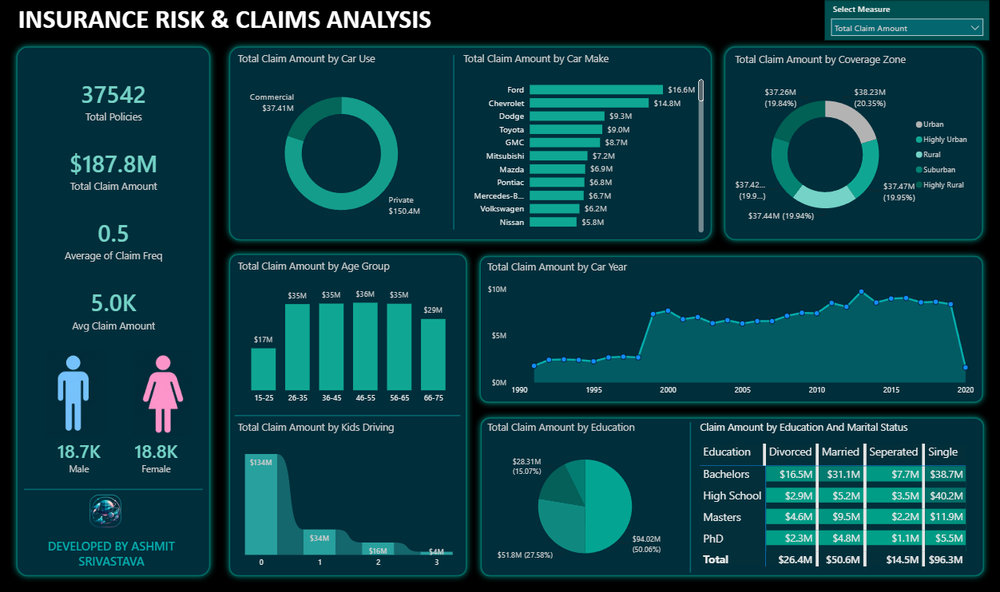

# 🛡️ Insurance Risk & Claims Analysis Dashboard

An interactive **Power BI dashboard** designed to analyze insurance policies, claim patterns, customer demographics, and risk indicators. The dashboard helps insurance companies identify high-risk segments, monitor claim trends, and support data-driven decision-making through dynamic visualizations and KPI tracking.

---

## 📌 Project Overview

Insurance companies generate large volumes of policy and claims data every day. Extracting meaningful insights from this data is essential for minimizing risk, optimizing pricing strategies, and improving customer service.

This dashboard transforms raw insurance policy data into an executive-level analytics solution that enables stakeholders to:

- Monitor overall insurance portfolio performance.
- Analyze claim amounts across different customer segments.
- Identify high-risk demographics.
- Compare claim trends across vehicle categories.
- Understand the relationship between education, marital status, and claims.
- Track claim patterns over time.

---

## 📊 Dashboard Preview



---

# 🎯 Business Objectives

- Analyze total insurance claims across different customer segments.
- Identify which vehicle types generate the highest claim amount.
- Understand claim distribution by vehicle manufacturer.
- Discover demographic groups contributing the highest insurance costs.
- Analyze geographical risk using coverage zones.
- Monitor yearly trends in claim amounts.
- Study the impact of family structure and education on insurance claims.
- Build an interactive dashboard for business users with slicers and dynamic measures.

---

# 🛠 Tools & Technologies

- **Power BI Desktop**
- **Power Query**
- **DAX**
- **Microsoft Excel**
- Data Modeling
- Interactive Dashboard Design

---

# 📂 Dataset Information

The dataset contains **37,542 insurance policy records** with customer, vehicle, and claims information.

### Features Included

| Category | Attributes |
|-----------|------------|
| Customer | Birth Date, Gender, Education, Marital Status |
| Vehicle | Car Make, Car Model, Car Year, Car Color, Car Use |
| Insurance | Coverage Zone |
| Claims | Claim Amount, Claim Frequency |
| Household | Household Income, Kids Driving |

---

# 📈 Dashboard KPIs

The dashboard provides high-level business metrics including:

- **Total Policies:** 37,542
- **Total Claim Amount:** **$187.8 Million**
- **Average Claim Frequency:** 0.5
- **Average Claim Amount:** $5K
- Gender-wise policy distribution

---

# 📊 Dashboard Features

## 1. Executive KPI Cards

Provides an instant overview of:

- Total Policies
- Total Claim Amount
- Average Claim Frequency
- Average Claim Amount

---

## 2. Claim Amount by Car Use

Compares insurance claims between:

- Private Vehicles
- Commercial Vehicles

**Insight**

- Private vehicles account for the majority of claim costs.

---

## 3. Claim Amount by Car Make

Ranks manufacturers based on total claim amount.

Top contributing brands include:

- Ford
- Chevrolet
- Dodge
- Toyota
- GMC

This helps insurers identify vehicle brands associated with higher claim expenses.

---

## 4. Claim Amount by Coverage Zone

Visualizes claims across:

- Urban
- Highly Urban
- Rural
- Suburban
- Highly Rural

This enables geographical risk comparison.

---

## 5. Claim Amount by Age Group

Analyzes claims across different customer age brackets.

Age Groups:

- 15–25
- 26–35
- 36–45
- 46–55
- 56–65
- 66–75

This helps identify customer age segments with higher insurance payouts.

---

## 6. Claim Trend by Car Year

Shows yearly claim amount trends based on vehicle manufacturing year.

Useful for understanding:

- Older vs newer vehicle risks
- Long-term claim patterns
- Vehicle depreciation impact

---

## 7. Claim Amount by Kids Driving

Analyzes claim amount based on the number of young drivers in a household.

Categories:

- 0
- 1
- 2
- 3

Useful for evaluating family-related insurance risk.

---

## 8. Claim Amount by Education

Compares insurance claims across education levels:

- High School
- Bachelors
- Masters
- PhD

---

## 9. Education vs Marital Status Matrix

A detailed comparison showing claim amount by:

- Education
- Married
- Single
- Divorced
- Separated

This enables multidimensional customer profiling.

---

## 10. Dynamic Measure Selector

The dashboard includes a measure selector allowing users to switch between different metrics without changing visuals, making analysis more flexible and interactive.

---

# 📌 Key Business Insights

- Private-use vehicles generate significantly higher total claim amounts than commercial vehicles.
- Ford and Chevrolet account for the highest cumulative insurance claims among vehicle manufacturers.
- Claim amounts are distributed fairly evenly across coverage zones, indicating geographically balanced exposure.
- Middle-aged policyholders contribute the largest share of claim value.
- Households with no young drivers account for the majority of total claims due to their larger customer base.
- Education and marital status together reveal distinct customer segments with varying claim behaviors.
- Claim trends vary across vehicle manufacturing years, helping identify periods associated with higher insurance costs.

---

# 📈 Power BI Features Used

- Interactive Slicers
- Dynamic Measure Selection
- KPI Cards
- Donut Charts
- Bar Charts
- Area & Line Charts
- Matrix Visual
- Data Modeling
- Power Query Transformations
- DAX Measures
- Custom Theme & Dashboard Design

---

# 📁 Project Structure

```
Insurance-Risk-Claims-Analysis/
│
├── Dashboard.pbix
├── insurance_policies_data.xlsx
├── INSURANCECLAIMDASHBOARD.png
├── README.md
└── Assets/
```

---

# 🚀 How to Use

1. Clone this repository.
2. Open the `.pbix` file using **Power BI Desktop**.
3. Load the provided Excel dataset if required.
4. Explore the dashboard using the interactive slicers and visuals.
5. Analyze claim patterns across different customer and vehicle dimensions.

---

# 📚 Skills Demonstrated

- Business Intelligence
- Data Cleaning
- Data Modeling
- Data Visualization
- Dashboard Design
- DAX Calculations
- Power Query
- KPI Development
- Insurance Analytics
- Data Storytelling

---

# 💡 Future Enhancements

- Predictive claim risk scoring using Machine Learning.
- Customer churn analysis.
- Fraud detection dashboard.
- Premium recommendation model.
- Geographic map visualizations.
- Drill-through customer profiles.
- Row-Level Security (RLS) implementation.
- Automated dashboard refresh.

---

# 👨‍💻 Author

**Ashmit Srivastava**

**Data Analyst | Power BI | SQL | Excel | Python**

If you found this project useful, consider giving the repository a ⭐.
